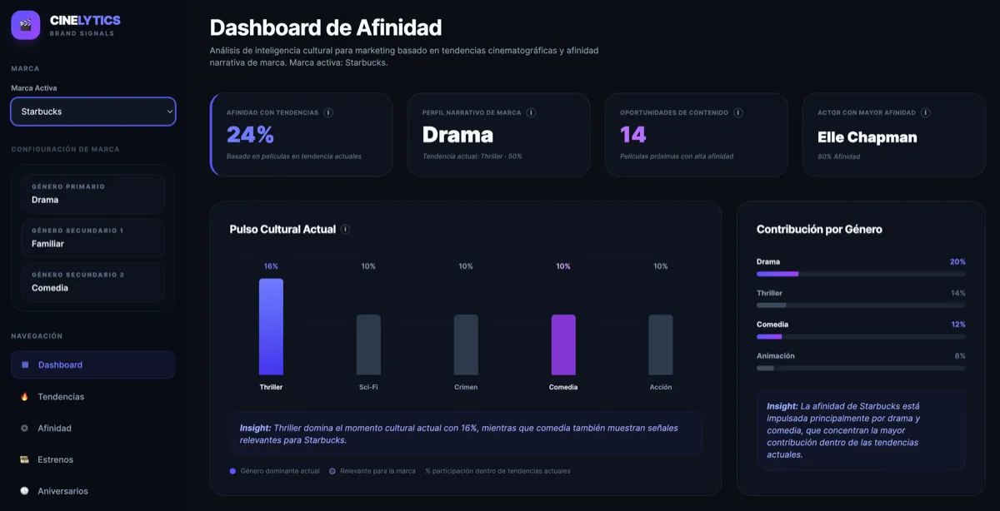
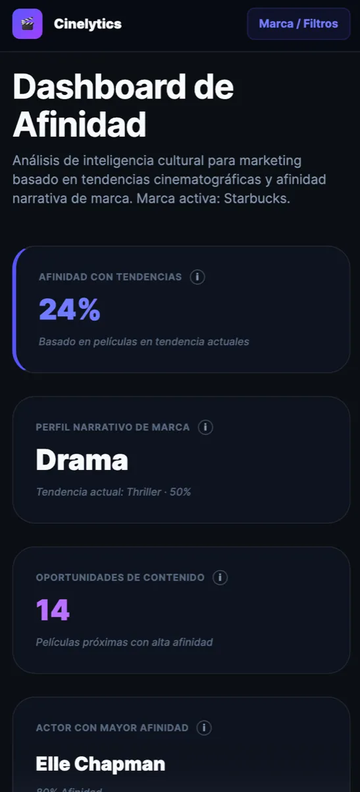
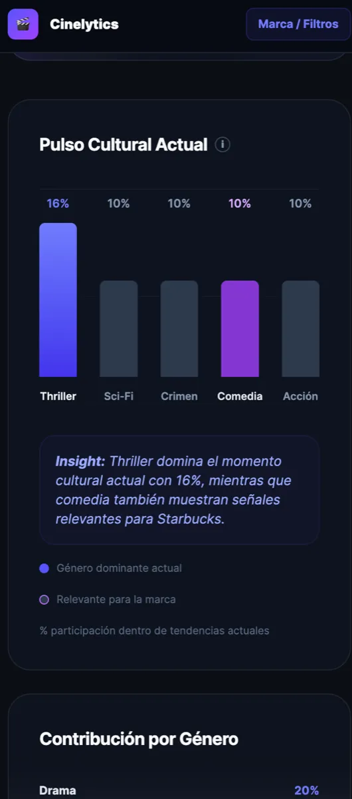
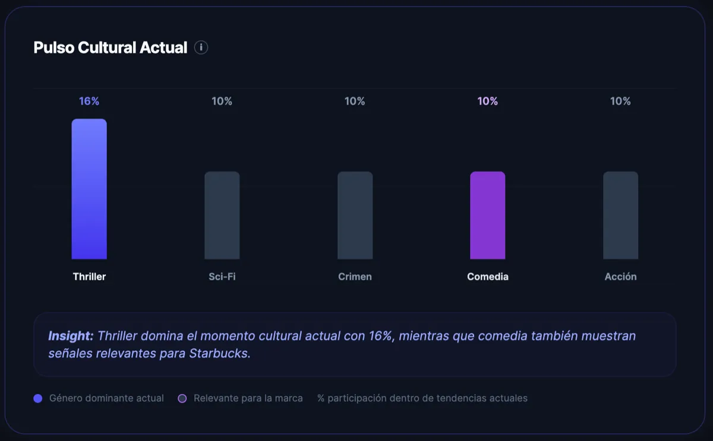
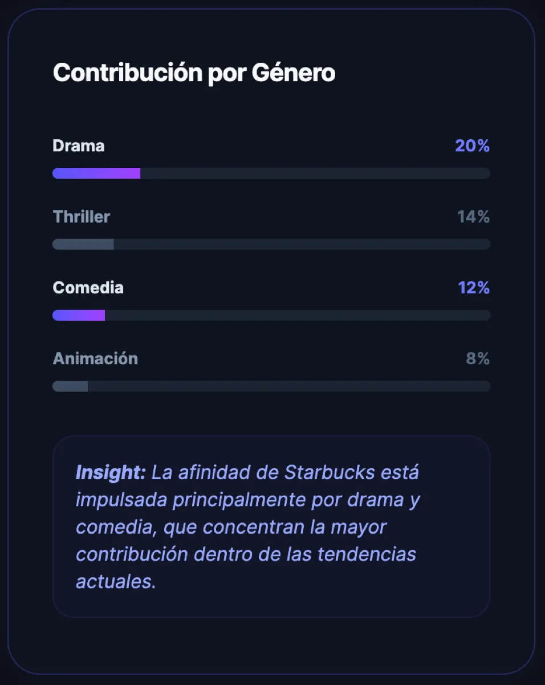
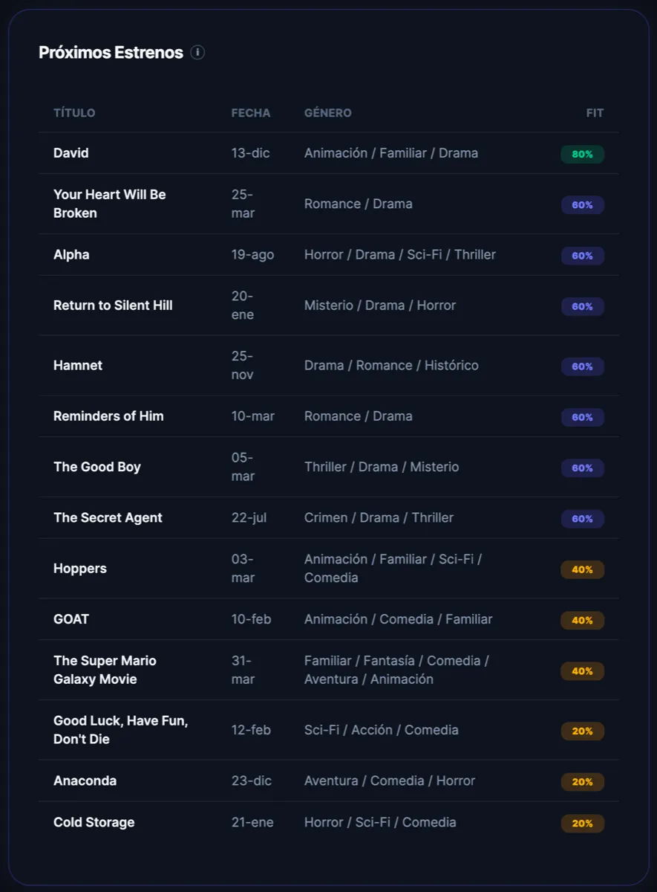
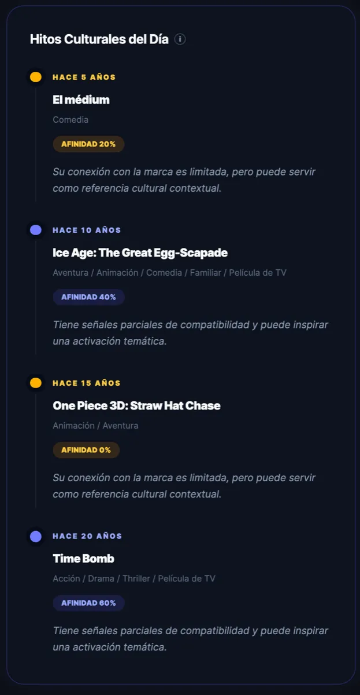
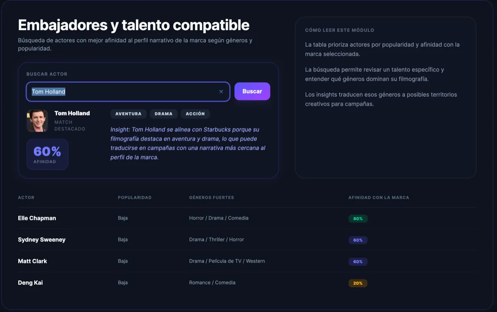

# Cinelytics — Dashboard de Afinidad Cultural

Proyecto desarrollado como prueba técnica para la posición de **Front-End Engineer** en Dinametra.


## 🚀 Demo en vivo 
https://cinelytics-dashboard.netlify.app/


## 📌 Descripción

**Cinelytics** es un dashboard interactivo que transforma datos públicos del cine en insights culturales útiles para marketing.

La aplicación utiliza la API de **TMDB (The Movie Database)** para analizar tendencias actuales, próximos estrenos, talento y hitos culturales, y los cruza con un **perfil narrativo de marca** para generar métricas e insights accionables.

El objetivo es responder preguntas como:

- ¿Qué tan alineada está una marca con las tendencias actuales?
- ¿Qué géneros dominan el momento cultural?
- ¿Qué oportunidades de contenido existen en próximos estrenos?
- ¿Qué actores encajan mejor con la narrativa de la marca?
- ¿Qué hitos culturales pueden aprovecharse hoy?

Ejemplo: Si el género “Drama” domina el momento cultural y coincide con la identidad de la marca, se pueden diseñar campañas emocionales alineadas a ese contexto.


## 🧠 Enfoque

El proyecto no se limita a mostrar datos, sino que busca:

1. Interpretar tendencias culturales desde una API pública  
2. Relacionarlas con una marca  
3. Generar insights claros y útiles para negocio  

Se diseñó como una simulación de herramienta de **marketing intelligence**.


## 💻 Stack Tecnológico

- React + TypeScript
- Vite
- TailwindCSS
- TMDB API
- Vitest + Testing Library


## 🌐 Fuente de datos

Se utilizó la API de **TMDB**.

### Endpoints principales:

- `/trending/movie/week`
- `/movie/upcoming`
- `/person/popular`
- `/search/person`
- `/person/{id}/movie_credits`
- `/discover/movie` (para fechas específicas)


## 📊 Funcionalidades principales

### 1. Afinidad con Tendencias
**Qué es:**  
Un indicador que muestra qué tan alineada está la marca con las tendencias actuales del cine.

**Cómo se obtiene:**
- Se consumen películas desde `/trending/movie/week`
- Se comparan los géneros de cada película con el perfil de marca
- Se calcula un score por película:
  - Género primario → +3
  - Géneros secundarios → +1 cada uno
- Se promedia el resultado y se convierte a porcentaje

### 2. Perfil Narrativo de Marca
**Qué es:**  
La definición base de la identidad narrativa de la marca dentro del sistema.


**Cómo se obtiene:**
- Es una configuración interna definida en el código
- Se utiliza como referencia para todos los cálculos de afinidad

### 3. Oportunidades de Contenido
**Qué es:**  
Un indicador de cuántos próximos estrenos representan oportunidades de contenido para la marca.

**Cómo se obtiene:**
- Se consumen datos desde `/movie/upcoming`
- Se calcula afinidad por película
- Se cuentan aquellas que superan un umbral mínimo de relevancia

### 4. Actor con Mayor Afinidad
**Qué es:**  
El actor más alineado narrativamente con la marca.

**Cómo se obtiene:**
- Se obtiene una lista desde `/person/popular`
- Para cada actor se consultan créditos (`/movie_credits`)
- Se identifican sus géneros más frecuentes
- Se calcula afinidad contra el perfil de marca
- Se selecciona el actor con mayor score

### 5. Pulso Cultural Actual
**Qué es:**  
Una visualización de los géneros dominantes en el momento cultural actual.

**Cómo se obtiene:**
- Se consumen datos desde `/trending/movie/week`
- Se contabiliza cuántas veces aparece cada género
- Se calcula el porcentaje sobre el total de ocurrencias

### 6. Contribución por Género
**Qué es:**  
Una explicación del origen de la afinidad de la marca.

**Cómo se obtiene:**
- Se parte de las películas en tendencia
- Se calcula afinidad por película
- Se distribuye la contribución de ese score por género
- Se agregan los resultados para obtener porcentajes

### 7. Próximos Estrenos
**Qué es:**  
Una lista de películas próximas relevantes para la marca.

**Cómo se obtiene:**
- Se consumen datos desde `/movie/upcoming`
- Se calcula afinidad por título
- Se ordenan por compatibilidad
- Se generan insights simples por cada película

### 8. Hitos Culturales del Día
**Qué es:**  
Una selección de películas relevantes estrenadas en esta misma fecha en años anteriores( 5, 10, 15 y 20 años).

**Cómo se obtiene:**
- Se usa `/discover/movie`
- Se filtra por fecha exacta:
  - `primary_release_date.gte`
  - `primary_release_date.lte`
- Se ordena por popularidad
- Se toma la película más relevante de cada año
- Se calcula afinidad contra la marca

### 9. Embajadores y Talento Compatible
**Qué es:**  
Un listado de actores con alta compatibilidad narrativa con la marca.


**Cómo se obtiene:**
- Se obtienen actores desde `/person/popular`
- Se analizan sus créditos (`/movie_credits`)
- Se identifican sus géneros principales
- Se calcula afinidad contra la marca
- Se construye una tabla ordenada por score


## 📸 Capturas de pantalla

### Dashboard general
 

|  |  |
|----------|----------|
|  |  |


### KPIs
 

### Peso cultural
 

### Contribución por Género
 

### Próximos estrenos
 

### Hitos culturales
 

### Embajadores y talento compatible
 


## 🧱 Arquitectura

La aplicación sigue una arquitectura basada en **features**, que permite escalar y mantener el código de forma organizada.

### Estructura principal

```txt
src/
  components/        → Componentes reutilizables (UI)
  constants/         → Configuración y datos estáticos
  features/
    brand/           → Lógica relacionada a perfiles de marca
    dashboard/       → Widgets, hooks y lógica del dashboard
  hooks/             → Hooks reutilizables
  services/          → Consumo de APIs externas
    mappers/         → Transformación de datos de API a modelos internos
  utils/             → Funciones utilitarias generales
  types/             → Tipos globales (TypeScript)
  test/              → Pruebas
```

## 📐 Principios aplicados

- **Separación de responsabilidades**
  - UI, lógica de negocio y acceso a datos están desacoplados

- **Modularidad**
  - Organización por features (`brand`, `dashboard`) para escalar fácilmente

- **Reutilización**
  - Componentes y utilidades compartidas entre widgets

- **Lógica desacoplada**
  - Funciones de negocio en `lib/`, independientes de React

- **Tipado fuerte**
  - Uso de TypeScript para prevenir errores y mejorar mantenibilidad

- **Enfoque pragmático**
  - Se evitó sobre-ingeniería, priorizando claridad y simplicidad


## ⚡ Rendimiento

- **Paralelización de requests**
  - Uso de `Promise.all` para múltiples llamadas a la API (ej. aniversarios)

- **Evitar llamadas duplicadas**
  - Se centralizó la obtención de datos para reutilizarlos entre widgets

- **Debounce en búsquedas**
  - Optimiza el input de búsqueda de actores evitando requests innecesarios

- **Transformación eficiente de datos**
  - Solo se procesa la información necesaria para cada widget

- **Estados independientes por widget**
  - Evita bloqueos globales en la UI


## 🧪 Testing

Se utilizaron **Vitest** y **Testing Library**.

### Cobertura implementada:

- **Unit tests**
  - Cálculo de afinidad
  - Generación de insights
  - Funciones puras del dominio

- **Integration tests**
  - Actualización del dashboard al cambiar la marca

- **UI / Interaction tests**
  - Apertura y cierre del drawer móvil
  - Render dinámico de componentes

### Enfoque:

- Priorizar lógica crítica
- Validar comportamiento real del usuario
- Evitar tests innecesarios de implementación interna


## 🌍 Compatibilidad entre navegadores

La aplicación fue desarrollada utilizando APIs estándar del navegador y probada en:

- Chrome
- Safari
- Firefox

### Consideraciones:

- No se utilizan APIs experimentales
- Uso de CSS moderno (Flexbox / Grid)
- Componentes accesibles y consistentes en distintos entornos

Esto garantiza una experiencia estable en navegadores modernos.


## ⚠️ Limitaciones y consideraciones

- **Dependencia de TMDB**
  - Toda la data proviene de la API
  - Sin soporte offline ni fallback

- **Modelo de afinidad simplificado**
  - Basado solo en géneros
  - No considera popularidad, rating o contexto cultural

- **Testing enfocado**
  - Prioridad en lógica y flujos principales
  - No cubre todos los componentes visuales


## ⚙️ Instalación y ejecución

### 1. Clonar el repositorio

```bash
git clone https://github.com/TU_USUARIO/TU_REPO.git
cd TU_REPO
```

### 2. Instalar dependencias

```bash
npm install
```

### 3. Configurar variables de entorno
Crear un archivo .env en la raíz del proyecto:
```bash
VITE_TMDB_READ_ACCESS_TOKEN=tu_api_key
```
>Puedes obtener tu API key en: https://www.themoviedb.org/

### 4. Ejecutar en entorno local

```bash
npm run dev
```

La aplicación estará disponible en:
```bash
http://localhost:5173
```

### 5. Ejecutar tests
```bash
npm run test
```


## 🧠 Decisiones técnicas clave

### 1. Uso de TMDB como fuente de datos
Se eligió la API de TMDB por su riqueza en datos relacionados a películas, géneros y talento, lo que permite construir una narrativa más allá de simples gráficos.

Esto permitió:
- Relacionar datos entre películas, actores y géneros
- Construir métricas derivadas (afinidad, oportunidades, insights)
- Simular un caso de uso real (marketing basado en tendencias)

---

### 2. Modelo de Afinidad (Core del proyecto)
Se implementó un modelo propio para medir la compatibilidad entre una marca y contenido cinematográfico.

Características:
- Basado en coincidencia de géneros
- Peso mayor al género principal de la marca
- Escalable a futuro (ej. incluir popularidad, rating, etc.)

Esto transforma datos crudos en insights accionables.

---

### 3. Arquitectura por features
En lugar de organizar por tipo de archivo (components, utils, etc.), se organizó por dominio:

- `brand` → lógica de afinidad
- `dashboard` → visualización e insights

Beneficio:
- Mayor escalabilidad
- Código más fácil de entender
- Mejor separación de responsabilidades

---

### 4. Separación UI vs lógica de negocio
Toda la lógica relevante (cálculos, transformaciones, insights) vive en funciones puras dentro de `lib/`.

Beneficio:
- Fácil testeo
- Reutilización
- Independencia de React

---

### 5. Generación de insights (valor agregado)
El dashboard no solo muestra datos, sino interpretación:

Ejemplo:
- “Alta compatibilidad con la marca”
- “Narrativa dominante del momento”

Esto eleva el proyecto de visualización a herramienta de análisis.

---

### 6. Manejo de estados y experiencia de usuario
Cada widget maneja:
- loading
- error
- empty state

Beneficio:
- Mejor UX
- Mayor resiliencia ante fallos de API

---

### 7. Eliminación de lógica y código no utilizado
Se realizó limpieza usando herramientas como `ts-prune` para eliminar código muerto.

Beneficio:
- Código más limpio
- Menor complejidad
- Mejor mantenibilidad

---

### 8. Balance entre complejidad y claridad
Se evitó sobre-ingeniería (ej. state managers innecesarios, abstracciones excesivas).

Decisión:
- Priorizar claridad y legibilidad sobre complejidad innecesaria

Resultado:
- Código fácil de entender para cualquier evaluador
